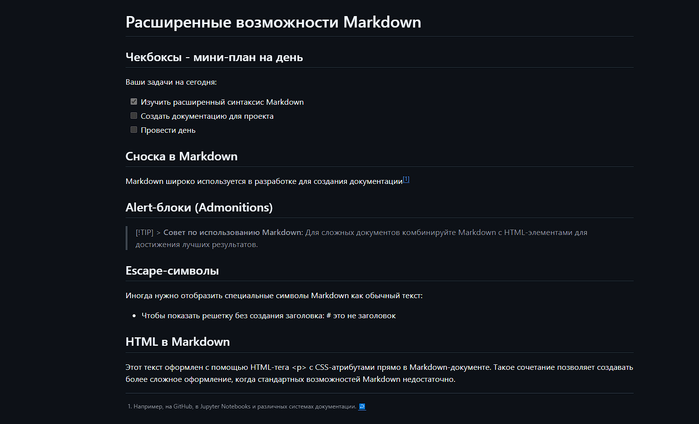

# Лабораторная работа №3: Markdown и LaTeX

## 📋 Краткое описание

Эта лабораторная работа посвящена изучению **Markdown** — лёгкого языка разметки для оформления документации, и **LaTeX** — системы для написания математических формул. Цель работы — освоить основные и продвинутые возможности форматирования текста, которые широко используются при создании README-файлов, документации проектов и технических отчётов.

---

## 📑 Содержание

1. [Заголовки и структура](#-заголовки-и-структура)
2. [Форматирование текста](#-форматирование-текста)
3. [Списки](#-списки)
4. [Ссылки и изображения](#-ссылки-и-изображения)
5. [Блоки кода и цитаты](#-блоки-кода-и-цитаты)
6. [Таблицы](#-таблицы)
7. [Продвинутые возможности](#-продвинутые-возможности)
8. [Математические формулы](#-математические-формулы)
9. [Структура проекта](#-структура-проекта)

---

## 🔤 Заголовки и структура

### Уровни заголовков

# H1 - Главный заголовок

## H2 - Раздел

### H3 - Подраздел

#### H4 - Дополнительный раздел

### Горизонтальные линии

Для разделения секций используются:

- Три дефиса: `---`
- Три звездочки: `***`
- Три подчеркивания: `___`

Пример:
Первая секция

---

Вторая секция

---

## ✏️ Форматирование текста

**Полужирный текст** - `**текст**` или `__текст__`

_Курсив_ - `*текст*` или `_текст_`

**_Жирный курсив_** - `***текст***`

~~Зачёркнутый текст~~ - `~~текст~~`

`Моноширинный текст` - `` `текст` ``

> **Пример цитаты:**  
> Это пример цитаты в Markdown. Цитаты используются для выделения важных мыслей или цитирования источников.
>
> _— Автор высказывания_

---

## 📝 Списки

### Маркированный список

- Первый пункт
- Второй пункт
- Третий пункт

### Нумерованный список

1. Первый элемент
2. Второй элемент
3. Третий элемент

### Вложенный список

1. Основной пункт
   - Подпункт A
   - Подпункт B
     - Дополнительный пункт
     - Еще один пункт
2. Еще основной пункт

### Список задач

- [x] Изучить базовый синтаксис Markdown
- [ ] Практиковаться с таблицами
- [ ] Освоить LaTeX формулы
- [ ] Создать финальный README

---

## 🔗 Ссылки и изображения

### Внешние ссылки

- [GitHub](https://github.com) - Крупнейшая платформа для разработчиков
- [Markdown Guide](https://www.markdownguide.org/) - Официальное руководство
- [LaTeX Project](https://www.latex-project.org/) - Официальный сайт LaTeX

### Локальные изображения

### Внутренние ссылки

Перейти к [Содержанию](#-содержание) или к [Форматированию текста](#-форматирование-текста)

---

## 10. Чекбоксы (Списки задач)

### Ежедневные задачи разработчика:

- [ ] Проверить и ответить на issues
- [ ] Написать unit-тесты
- [x] Закоммитить изменения
- [ ] Создать pull request
- [ ] Провести code review

### Задачи проекта:

- [x] Инициализировать Git-репозиторий
- [x] Создать структуру проекта
- [ ] Написать документацию
- [ ] Добавить примеры кода
- [ ] Протестировать функционал

### Task 1: Настройка окружения

- [x] Установить Git
- [x] Настроить VS Code
- [ ] Установить расширения Markdown
- [ ] Проверить работу LaTeX

### Task 2: Создание документации

- [ ] Написать README.md
- [ ] Добавить скриншоты
- [ ] Оформить примеры кода
- [ ] Проверить форматирование

## 11. Сноска

Markdown — это легковесный язык разметки, который широко используется разработчиками для создания документации[^markdown]. Особенно полезен при работе с системами контроля версий[^git].

GitHub поддерживает расширенный синтаксис Markdown[^github], включая таблицы, чекбоксы и математические формулы.

Примечания и ссылки на источники оформляются через сноски[^footnote], что улучшает читаемость документа.

[^markdown]: Markdown создан Джоном Грубером в 2004 году. Подробнее на [daringfireball.net](https://daringfireball.net/projects/markdown/)
[^git]: Git — распределенная система контроля версий, созданная Линусом Торвальдсом
[^github]: GitHub начал поддерживать математические формулы с LaTeX в 2022 году
[^footnote]: Сноски отображаются в конце документа и не мешают основному тексту

## 12. Alert-блоки GitHub

> [!NOTE] > **Важная информация:**  
> GitHub поддерживает специальные alert-блоки для выделения различных типов сообщений. Они отображаются только на платформе GitHub.

> [!TIP] > **Полезный совет:**  
> Используйте `> [!TIP]` для выделения полезных советов и рекомендаций. Такие блоки привлекают внимание к важным моментам.

> [!WARNING] > **Предупреждение:**  
> Будьте внимательны при использовании некоторых расширенных функций Markdown, так как не все редакторы их поддерживают.

## 13. Inline LaTeX

### Математические выражения в тексте:

- **Площадь круга:** $S = \pi r^2$ где $r$ — радиус окружности

## 14. Block LaTeX

#### Сумма арифметической прогрессии:

$$
\sum_{i=1}^n i = \frac{n(n+1)}{2}
$$
